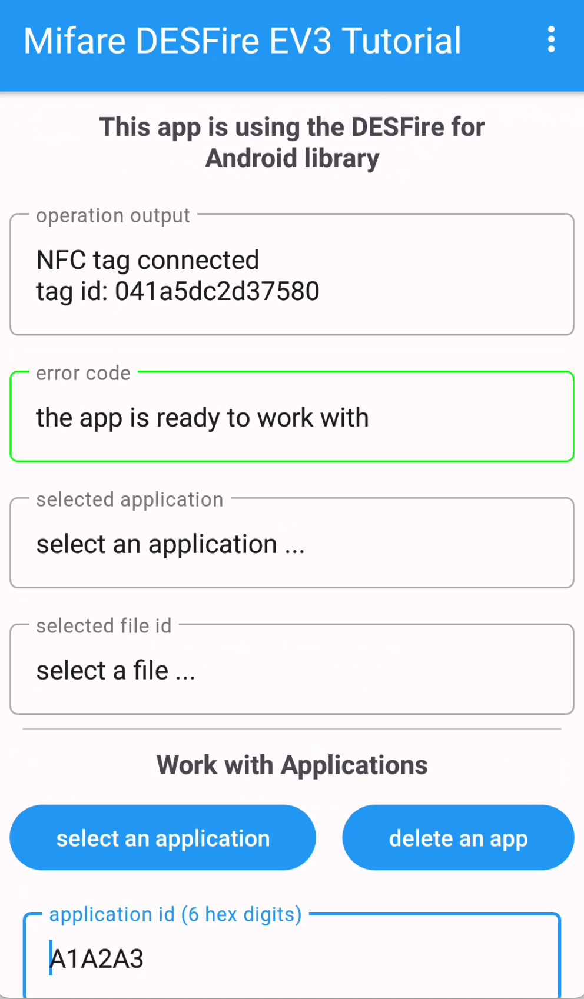

# Mifare DESFire EV1/2/3 Tutorial using NFCjLib

This app is using the NFCjLib library from **Desfire Tools for Android** available on GitHub here:
https://github.com/skjolber/desfire-tools-for-android. It was written by Thomas Skjølberg ("skjolber") and this one is the best available source for accessing 
NXP's Mifare DESFire tags. 

If you are trying to get basic information's about the DESFire tag the first contact point is the manufacturer's datasheet, available here:
- DESFire EV1 MF3ICDX21_41_81_SDS: https://www.nxp.com/docs/en/data-sheet/MF3ICDX21_41_81_SDS.pdf
- DESFire EV2 MF3DX2_MF3DHX2_SDS: https://www.nxp.com/docs/en/data-sheet/MF3DX2_MF3DHX2_SDS.pdf
- DESFire EV3 MF3D(H)x3: https://www.nxp.com/docs/en/data-sheet/MF3DHx3_SDS.pdf
- DESFire EV3 Quick start guide: https://www.nxp.com/docs/en/application-note/AN12753.pdf
- DESFire EV3 feature and functionality comparison to other MIFARE DESFire products: https://www.nxp.com/docs/en/application-note/AN12752.pdf

Unfortunately the 3 main datasheets are shortened by the manufacturer and the full datasheets are available under **Non disclosure agreements (NDA)** only - 
the agreement is not available for private persons.

So the only chance is to use the **datasheet for the first version of DESFire tags ("D40")** using this link: https://neteril.org/files/M075031_desfire.pdf.

Another fine piece of information is the **NXP MIFARE DESFire EV1 Protocol** available here: https://github.com/revk/DESFireAES/blob/master/DESFire.pdf. 
This is a short overview about most of the DESFire EV1 commands and error codes.

If you need some basic information I recommend this document, written by Daniel Andrade (and others) who wrote the NFCjLib: 
https://github.com/andrade/notes-about-desfire/blob/master/nfc-0.4.pdf

All mentioned documents are stored in the docs folder of this repository (please beware they could be outdated, so please use the official download links).

## About this app:

It is developed using Android Studio version Hedgehog | 2023.1.1 Patch 2 and is running on SDK 21 to 33 (Android 13) (tested on 
Android 8, 9 and 13 with real devices).  

The main purpose of the app is to run all basic functions on a DESFire tag in one application using **AES keys** and in all available communication modes:
- **Plain / open communication**
- **MACed communication**
- **Encrypted communication**

This should be the perfect beginner app as it uses a brand new DESFire tag with it's factory settings.

Some notes on typical sessions with the card: I recommend that you lay your phone on the tag and after the connection don't move the phone to hold the 
connection.

The usage of the app is described in an article I published on medium.com: https://medium.com/@androidcrypto/mifare-desfire-ev3-a-beginner-tutorial-android-java-using-the-desfire-for-android-tools-00aaecb8fa93

## Ready to use compiled and build debug app

A ready to use app in DEBUG mode is available under the debug folder.

## Alternative libraries

This is an uncurated list of libraries that are been able to run Mifare DESFire commands or useful to run a communication:

TapLinx (official SDK by NXP, requires just a registration) : https://www.mifare.net/en/products/tools/taplinx/

DESFire Tools for Android: https://github.com/skjolber/desfire-tools-for-android

Android NFC Lib: https://github.com/entur/android-nfc-lib

LibreFreeFare (Java): https://github.com/skjolber/desfire-tools-for-android/tree/master/libfreefare

LibreFreeFare (C): https://github.com/nfc-tools/libfreefare

GitHub search on DESFire libraries: https://github.com/search?q=desfire&type=repositories

TagInfo (Android app by NXP to get information about NFC tags): https://play.google.com/store/apps/details?id=com.nxp.taginfolite&hl=de&gl=US

## Dependencies

I'm using 2 external dependencies for this project, but I did not load them with Gradle but included the source code. 
This is specially due to the fact that I'm trying to understand how the workflow for the communication with the 
Mifare DESFire tag is going on. The best way for this is to have a direct access to the underlying source code.

The main library for the access to Mifare DESFire tags are the **DESFire Tools for Android**, written by Thomas Skjølberg ("skjolber"), 
available here: https://github.com/skjolber/desfire-tools-for-android 

The licenses for this library are a mixture:
- nfcjlib - Modified BSD License (3-clause BSD): https://github.com/skjolber/desfire-tools-for-android/blob/master/nfcjlib/LICENSE
- libfreefare - LGPL 3.0 with classpath exception: https://github.com/skjolber/desfire-tools-for-android/blob/master/libfreefare/LICENSE.txt (Note: I did not use this part of the repository)
- everything else - Apache 2.0: http://www.apache.org/licenses/LICENSE-2.0.html

The second dependency is the **NumberPicker**, written by Shawn, available here: https://github.com/ShawnLin013/NumberPicker. It gives an easy way 
to select a file number in a specific range.

MIT-License: https://github.com/ShawnLin013/NumberPicker/blob/master/LICENSE

I'm using an app icon created by Ahkâm and then changed for this app: 
Nfc Simple PNG Transparent Background: https://www.freeiconspng.com/img/20581

<a href="https://www.freeiconspng.com/img/20581">Nfc Png Simple</a>

I used this online service to change the icon to my needs: Icon / Vector editor: https://editor.method.ac/
